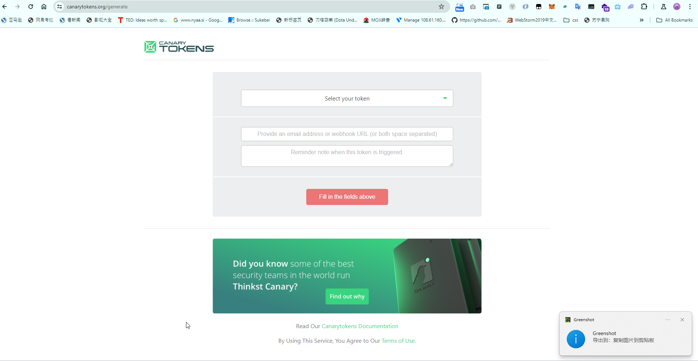
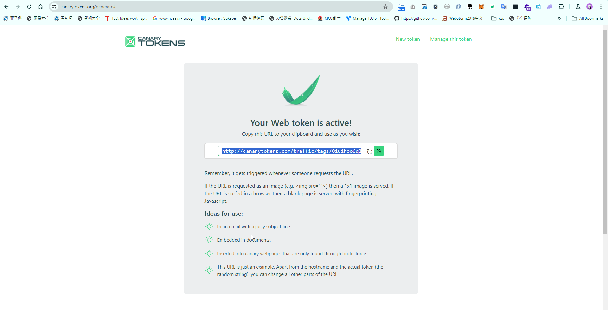
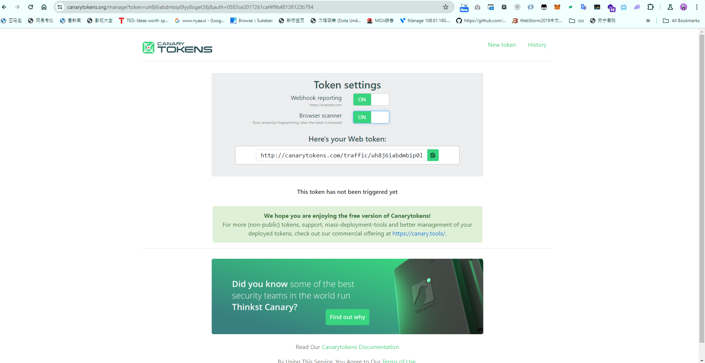
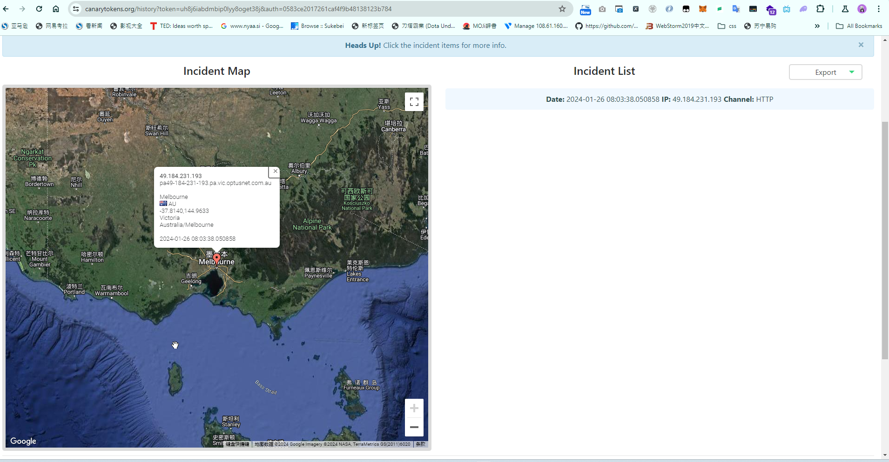
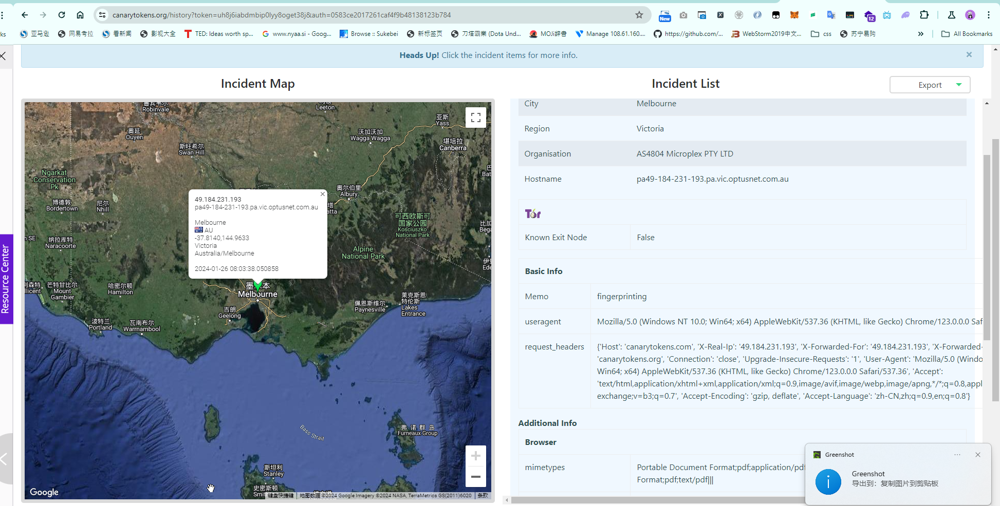
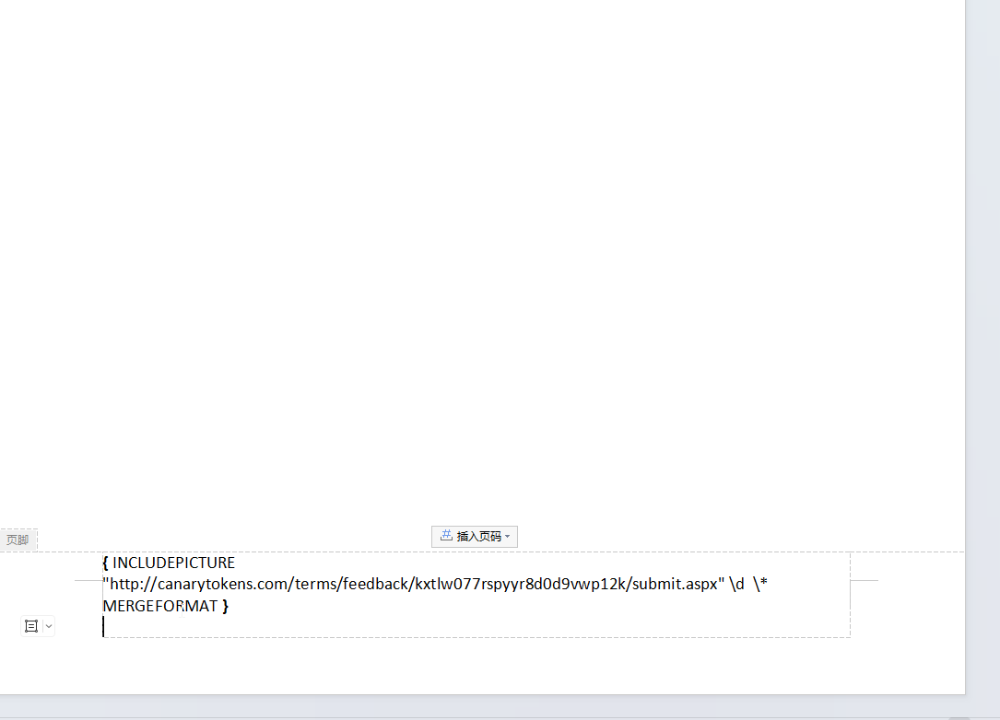

## client Fingerprinting
1. Objective of Client Fingerprinting:  
    It's used to obtain crucial details such as the operating system, browser type, and IP address of a target's device. This information can be invaluable when planning an attack or penetration test, as it helps in tailoring the approach to the specific environment of the target.  

2. Initial Steps:  
    The process often starts by gathering preliminary information like email addresses using tools such as theHarvester. This information forms the basis of the subsequent client-side attack.  

3. Executing the Attack:  
    The attacker may use an HTML Application (HTA) file attached to an email. When the target opens the HTA file, it executes in the context of their browser (typically Internet Explorer or Microsoft Edge). This method is popular among attackers because it's an effective way to gain an initial foothold in the target's network.

4. Confirming the Target's Environment:  
    Before proceeding, it's crucial to confirm that the target is using a compatible operating system (Windows) and has the vulnerable browser (Internet Explorer or Microsoft Edge). For this, tools like Canarytokens are used. These tools generate a unique link that, when clicked by the target, provides the attacker with information about the target's browser, IP address, and operating system.

5. Crafting a Convincing Pretext:  
    To make the target click on the link, a convincing pretext or context is necessary. This involves crafting a scenario that aligns with the target's role or interests. For instance, if the target works in a finance department, the attacker might pretend to discuss an issue related to an invoice, enticing the target to click on a link supposedly showing the problematic invoice.

6. Outcome:  
    When the target clicks the link (the Canarytoken), it doesn't lead to any real content (they see a blank page), but the action provides the attacker with a "fingerprint" of the target's system. This includes the IP address, browser details, and operating system information, crucial for planning the next steps of the attack.
* Canarytokens https://canarytokens.org/generate  
    * select way to get the link  
    
    
    * mange the token(web hook: get the up to date alert in targer server/ search for browser)
    
    * then we can find result in history
    
    

    * there is also other option we can use to get the fingerprinting The detail tech is in here. https://www.ddosi.org/canarytokens/

    * in here the reason is that we can use it to get the fingerprinting, is the word in yejiao there is request to canary.com
        * chatgpt: 在Microsoft Word文档中，某些内容如字段代码默认是不显示的，直到你执行某些操作来揭示它们。字段代码是Word中用来插入和显示动态信息的特殊代码。例如，INCLUDEPICTURE 字段代码用来插入图片，但在默认的视图模式下，这个字段通常是隐藏的，直到你切换到显示字段代码的视图。  
        在您提供的屏幕截图中，显示了一个 INCLUDEPICTURE 字段代码，它正尝试从一个URL加载图片。这个URL很可能是一个Web Bug，因为它指向了一个Canary Token的URL。当文档打开时，如果字段代码被更新（例如，当打印或在阅读模式下查看文档时），Word会尝试从这个URL加载图片，从而触发访问通知。only when you search http this key word you can find it.
        
        INCLUDEPICTURE  "http://canarytokens.com/terms/feedback/kxtlw077rspyyr8d0d9vwp12k/submit.aspx" \d